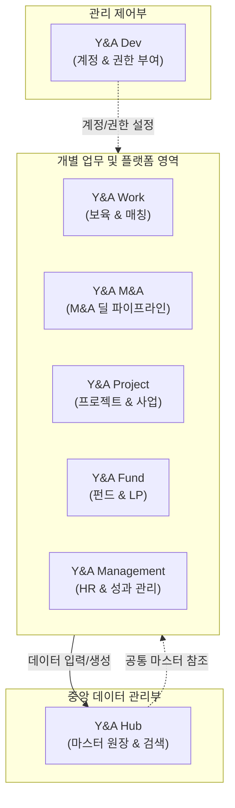
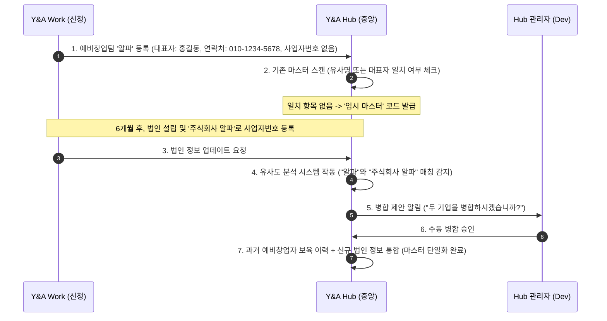

# Y&A Suite 통합 기획 및 데이터 아키텍처 사양서
*(Y&A Enterprise Suite Product Planning Specification)*

본 문서는 Y&A의 통합 데이터베이스 **Y&A Hub**와 최고 관리자 플랫폼 **Y&A Dev**, 그리고 5대 개별 업무 툴(**Work, M&A, Project, Fund, Management**) 간의 유기적인 연계 방식 및 데이터 아키텍처를 정의하는 공식 기획 문서입니다.

기존 구현체인 `yna-db`와 `yna-matching`은 새 Suite의 서비스 원형으로 참고한다. 단, DB 스키마 경계, 권한, RLS, 감사 로그는 새 Suite 정책을 우선한다. 자세한 반영 기준은 `yna_suite_existing_source_alignment.md`를 따른다.

---

## 1. Y&A Suite 플랫폼 라인업 구성

각 서비스는 명확한 타겟 사용자와 도메인 영역을 가지며, 상호 연동되어 하나의 데이터 생태계를 이룹니다.



| 서비스명 | 대상 사용자 | 주요 기능 및 역할 |
| :--- | :--- | :--- |
| **1. Y&A Hub** | 전사 임직원 및 경영진 | 전사 통합 검색, 정제된 스타트업/전문가/협력사 마스터 원장, 전사 지표 요약 대시보드 |
| **2. Y&A Dev** | 최고 시스템 관리자 및 개발자 | 통합 SSO 계정 생성, 6개 서비스별 역할 기반 권한(RBAC) 일괄 매핑 및 제어 |
| **3. Y&A Work** | 프로그램 매니저, 스타트업, 외부 전문가 | Program First 기반 전주기 운영(모집, 신청자/참여자 관리, 서류평가, 현장평가, OT, 멘토링, 비즈니스 매칭, 데모데이, 성과관리, 커스텀 행사, 회의록) |
| **4. Y&A M&A** | M&A 실무 심사역, 자문 파트너 | M&A 딜 소싱 파이프라인, 매수/매도 자문 이력 관리, 실사 자료 및 딜 클로징 현황 |
| **5. Y&A Project** | 프로젝트 담당 심사역, 협력 기관 | 공공/민간 수주 사업 일정, 사내 R&D 프로젝트 마일스톤, 투입 인력(M/M) 및 협력사 매핑 |
| **6. Y&A Fund** | 투자실 임직원, 출자자(LP) | 펀드 조합원 관리, 출자 비율, 캐피탈콜 차수별 납입 현황, 피투자사 지분율 및 펀드 소진율 추적 |
| **7. Y&A Management** | 경영지원팀, 전략기획팀 | 인적자원관리(HRM/HRD), 부서별 운영성과 관리(매출, 이익, 고정비, 변동비를 기반으로 한 효율성 산출) |

---

## 2. 데이터베이스 스키마(Schema) 분리 아키텍처

데이터베이스는 **하나의 물리 DB(Supabase)**를 공유하지만, 각 서비스의 도메인 결합도를 낮추고 데이터 보안을 극대화하기 위해 **논리적 스키마(Logical Schema)**를 분리하여 설계합니다.

```sql
-- 1. Y&A Hub 스키마 (마스터 테이블)
CREATE SCHEMA hub;
CREATE TABLE hub.startups (...); -- 정제된 최종 마스터 기업 원장
CREATE TABLE hub.experts (...);  -- 정제된 최종 마스터 전문가 원장
CREATE TABLE hub.partners (...); -- 정제된 최종 마스터 협력사 원장

-- 2. Y&A Dev 스키마 (계정 및 개별 권한 토글)
CREATE SCHEMA dev;
CREATE TABLE dev.user_permissions (
    user_id UUID REFERENCES auth.users(id),
    domain_name VARCHAR(50), -- 'hub', 'dev', 'work', 'mna', 'project', 'fund', 'management'
    can_read BOOLEAN DEFAULT FALSE,
    can_write BOOLEAN DEFAULT FALSE,
    PRIMARY KEY (user_id, domain_name)
);

-- 3. Y&A Work 스키마 (Program First 실행/운영 기록용)
CREATE SCHEMA work;
CREATE TABLE work.programs (...);
CREATE TABLE work.program_modules (...);
CREATE TABLE work.applications (...);
CREATE TABLE work.program_activities (...);
CREATE TABLE work.meeting_minutes (...);

-- 4. Y&A M&A 스키마 (M&A용)
CREATE SCHEMA mna;
CREATE TABLE mna.deals (...);

-- 5. Y&A Project 스키마 (프로젝트용)
CREATE SCHEMA project;
CREATE TABLE project.milestones (...);

-- 6. Y&A Fund 스키마 (투자/펀드용)
CREATE SCHEMA fund;
CREATE TABLE fund.ledgers (...);

-- 7. Y&A Management 스키마 (경영관리용)
CREATE SCHEMA management;
CREATE TABLE management.hrm_records (...); -- 인사 평정 및 HRM 기록
CREATE TABLE management.performance_metrics (...); -- 매출, 이익, 고정비/변동비 집계
```

---

## 3. 스타트업 마스터 식별 및 병합(Deduplication) 기획

예비창업자(예비사업자)는 사업자등록번호가 없어 단순 유니크 키 매핑이 불가능합니다. 이를 해결하기 위해 **"유사도 분석 제안 ➔ 수동/반자동 병합 프로세스"**를 제안합니다.



### 3.1 마스터 코드(Master Code)의 정의와 역할

마스터 코드는 여러 서비스 및 스키마에 흩어져 보관되는 동일한 개체(기업, 전문가, 협력사)를 시스템적으로 동일 인물/기업이라고 보증하고 연계해주는 **전사 고유 식별 코드**입니다.

1. **도메인 간 데이터 조인(Join)의 열쇠 (물리적 관점)**:
   * `work.applications`(지원 이력), `mna.deals`(인수합병), `fund.ledgers`(투자 지분) 테이블은 대상 기업을 참조할 때 각각 개별 필드를 가지는 대신, **Hub 마스터 테이블의 PK인 마스터 코드를 외래키(FK)**로 바라봅니다.
   * 이를 통해 전사 통합 검색 시 마스터 코드 기준 단 한 번의 쿼리로 해당 스타트업의 전 주기 생애 이력을 추출합니다.
2. **비즈니스 연속성 보장 (예비창업 ➔ 법인 매핑 전환)**:
   * 예비창업 단계에서 등록된 임시 마스터 코드(`TEMP-ST-092`)로 누적된 멘토링, 평정 등의 보육 데이터는 법인 설립에 따라 정식 마스터 코드(`YNA-ST-0104`)로 병합될 때 소실되지 않습니다. 
   * Hub 상에서 매핑 관계를 갱신함으로써 과거 데이터가 정식 법인 데이터로 온전히 상속됩니다.
3. **가독성 높은 식별 체계 제공 (사용자 관점)**:
   * 시스템 내부에서 사용하는 UUID(예: `3b8d9c12-e89a...`) 외에 엑셀 다운로드나 보고서 작성 시 사람이 쉽게 구별할 수 있도록 가독성이 있는 코드를 부여합니다.
   * 예시: `YNA-ST-2026-0001` (스타트업), `YNA-EX-2026-0042` (전문가), `YNA-PT-2026-0012` (협력사)

### 💡 병합 시 데이터 매핑 정책
*   **기본 정보 우선순위**: 신규 입력된 공식 법인 정보(법인명, 사업자번호, 대표 주소 등)가 기존 예비창업자 시점의 임시 정보보다 우선하여 마스터 원장에 덮어씌워집니다.
*   **이력 승계**: 기존 예비창업팀 시절 받았던 `Y&A Work` 상의 멘토링 이력, 서면평가 점수, 참여 프로그램 데이터는 소실되지 않고 병합된 최종 스타트업 마스터 ID와 1:N 관계로 묶여 보존됩니다.

---

## 4. 통합 계정(SSO) 및 Y&A Dev를 통한 권한 제어

모든 사용자는 단 하나의 아이디/비밀번호로 로그인하지만, 각 개별 서비스(도메인)에 대한 접근 및 편집 권한은 **개별적인 Read/Write 토글**로 통제됩니다.

### 4.1 도메인별 세부 권한 제어 (Fine-Grained Permissions)

`dev.user_permissions` 테이블을 조작해 사용자별로 7개 도메인에 대한 읽기/쓰기를 미세 제어합니다. 아래는 권한 그룹 템플릿(디폴트 추천값) 매핑 예시입니다.

| 권한 그룹 템플릿 | Y&A Hub | Y&A Dev | Y&A Work | Y&A M&A | Y&A Project | Y&A Fund | Y&A Management |
| :--- | :--- | :--- | :--- | :--- | :--- | :--- | :--- |
| **1. MASTER** | Read / Write | **Read / Write** | Read / Write | Read / Write | Read / Write | Read / Write | Read / Write |
| **2. 경영진** | Read | None | Read | Read | Read | Read | Read |
| **3. 경영실** | Read | None | Read | None | Read / Write | Read | **Read / Write** |
| **4. 투자실** | Read | None | Read | **Read / Write** | Read / Write | **Read / Write** | Read |
| **5. 사업부** | Read | None | **Read / Write** | None | **Read / Write** | None | Read |
| **6. 참가 전문가** | None | None | **Read** (Guest) | None | None | None | None |
| **7. 참가 스타트업** | None | None | **Read / Write** (Guest) | None | None | None | None |
| **8. 뷰어** | Read | None | Read | None | None | None | None |

> [!TIP]
> 위 테이블은 디폴트 템플릿일 뿐입니다. **Y&A Dev**에서 관리자는 특정 심사역에게 `기본: 사업부` 템플릿을 부여한 후, 임시 협업을 위해 `Y&A Fund`의 `Read` 권한 스위치를 개별적으로 켜줄 수 있습니다.

### 4.2 Supabase Row Level Security (RLS) 적용 구조

권한이 미세 튜닝되므로, 로그인 시점에 `dev.user_permissions`의 결과를 JWT `app_metadata.permissions`에 주입하고, DB 단 RLS는 이 JWT 값을 파싱해 권한을 빠르게 판단합니다. 매 row마다 권한 테이블을 조인하지 않는 No-Join 구조를 기본으로 합니다.

```sql
-- 예시: JWT claims를 읽는 공통 helper
CREATE OR REPLACE FUNCTION dev.can_write_domain(target_domain TEXT)
RETURNS BOOLEAN
LANGUAGE SQL
STABLE
AS $$
    SELECT COALESCE(
        (auth.jwt() -> 'app_metadata' -> 'permissions' -> target_domain ->> 'can_write')::BOOLEAN,
        FALSE
    );
$$;

-- 예시: Y&A Work.programs 테이블에 대한 INSERT/UPDATE RLS 정책
CREATE POLICY "Work 쓰기 권한 검증" ON work.programs
FOR INSERT, UPDATE TO authenticated
WITH CHECK (
    dev.can_write_domain('work')
);
```

---

## 5. 4대 핵심 자원의 유입 경로 및 데이터 라이프사이클

전사의 공통 핵심 자원 중 **심사역**은 시스템 권한과 직결되므로 생성 경로가 제한되지만, 실무 데이터인 **스타트업, 전문가, 협력사**는 실무 편의를 위해 **Y&A Hub, Work, M&A, Project, Fund 어디서나 자유롭게 생성 및 매핑**할 수 있도록 허용합니다.

### 5.1 자원별 유입 및 관리 상세

#### ① 심사역 (Manager / Internal User)
*   **유입 및 생성 경로**: 최고 관리자 (Y&A Dev) 및 경영지원팀 (Y&A Management).
*   **데이터 흐름**: 
    1. **Y&A Dev**에서 이메일 기반 Supabase Auth 계정을 생성하고 권한을 부여합니다.
    2. **Y&A Management**의 HRM 모듈에서 해당 계정에 연결되는 인사 정보(직급, 직책, 부서, 관심 투자 분야)를 등록하여 **Y&A Hub**의 심사역 마스터 원장에 동기화합니다.
    * *보안 정책상 타 실무 툴(Work, M&A 등)에서의 심사역 계정 직접 생성은 금지합니다.*

#### ② 스타트업 / 전문가 / 협력사 (Core Assets)
*   **유입 및 생성 경로**: **Y&A Hub, Y&A Work, Y&A M&A, Y&A Project, Y&A Fund** 5개 플랫폼 어디서나 실무자가 필요할 때 즉시 입력 가능.
*   **자산별 세부 입력 시나리오**:
    *   **스타트업**: `Work`에서 프로그램 지원 시, `M&A`에서 소싱 시, `Fund`에서 투자 집행 등록 시, `Hub`에서 마스터 등록 시 각 화면에서 즉시 생성.
    *   **전문가**: `Work`에서 멘토/평가위원 매핑 시, `Hub`에서 대량 엑셀 업로드 시 각 화면에서 즉시 생성.
    *   **협력사**: `Project`에서 컨소시엄 파트너 등록 시, `M&A`에서 자문사 등록 시, `Fund`에서 LP 등록 시 각 화면에서 즉시 생성.
*   **중앙 통합 방식**: 각 툴에서 자산을 생성하면 해당 정보는 **Y&A Hub**의 `임시 대기 풀`로 자동 전집되며, 중복이 없는 경우 최종 마스터로 안전하게 합쳐집니다.

### 5.2 중복 방지를 위한 로컬 입력 UX 원칙

실무자가 업무 중 새로운 기업, 전문가, 협력사를 등록할 때 중복 데이터를 차단하기 위해 아래 3단계 UX 원칙을 적용합니다.

1. **실시간 검색 우선 (Autocompletion First)**:
   * 입력 필드에 이름을 치는 동안 **Y&A Hub** 마스터 DB를 즉시 검색하여 이미 등록된 정보가 있는지 드롭다운으로 추천합니다.
   * 이미 존재하는 자원이면 그것을 선택해 연계 관계(FK)만 형성합니다.
2. **임시 등록 허용 (Lazy Creation)**:
   * 검색 결과가 없는 신규 자원인 경우, 실무자는 즉시 신규 입력을 완료해 업무 흐름을 이어갑니다. 
   * 이 데이터는 즉시 업무용 로컬 테이블에 쓰이고, 동시에 **Y&A Hub**의 "승인 대기 풀"로 자동 분류되어 전송됩니다.
3. **중앙 정제 및 병합 (Consolidation)**:
   * **Y&A Hub** 관리자는 정기적으로 승인 대기 풀을 검토하여, 누락 정보를 보완하고 유사 자원을 수동/반자동 병합 처리하여 전사 데이터 오염을 예방합니다.
