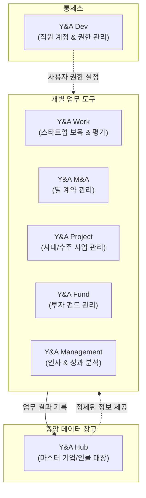

# 1. Y&A 서비스 통합 기획서 (개요)

이 문서는 비전공자(기획자/경영진)가 읽고 이해할 수 있도록 어려운 기술 용어를 배제하고 작성된 **Y&A 서비스의 전사 개요**입니다.

---

## 1. 서비스의 탄생 목적
현재 Y&A의 데이터(스타트업 정보, 외부 전문가 정보, 투자금 현황, 프로젝트 참여자 등)는 여러 프로그램과 엑셀 시트에 파편화되어 흩어져 있습니다. 
이 서비스의 목적은 **"모든 데이터를 한곳으로 모으고, 하나의 로그인 계정으로 여러 업무 도구들을 쉽고 안전하게 사용하는 통합 플랫폼"**을 구축하는 것입니다.

---

## 2. 전체 플랫폼의 구성 (업무 도구 라인업)

우리가 만드는 플랫폼은 중앙 데이터 창고를 중심으로 6개의 업무 프로그램이 유기적으로 연결됩니다.

### ① Y&A Hub (중앙 데이터 창고)
*   **역할**: 회사 전체의 **"단 하나의 공식 대장"**입니다.
*   **내용**: 정제 완료된 스타트업 정보, 전문가/멘토 목록, 협력기관 목록이 저장됩니다. 
*   **주요 기능**: 전사 통합 검색, 여러 곳에 중복 입력된 기업 정보를 하나로 합치는 기능(병합)을 제공합니다.

### ② Y&A Dev (마스터 통제소)
*   **역할**: 시스템 최고 관리자(마스터)가 사용하는 화면입니다.
*   **주요 기능**: 직원들을 이메일로 초대하고, 각 직원이 어떤 업무 도구(Work, Fund 등)를 사용할 수 있는지 스위치를 켜고 끄는 권한 관리기입니다.

### ③ Y&A Work (보육 및 매칭)
*   **역할**: 스타트업 지원 사업이나 행사 등의 전주기 운영 도구입니다.
*   **주요 기능**: 지원 사업 모집, 서류/현장 평가, 멘토 배정 및 멘토링 일정 관리, 회의록 및 첨부파일 관리.

### ④ Y&A Fund (투자 및 LP)
*   **역할**: 회사의 투자 자금과 피투자 기업 지분을 관리하는 도구입니다.
*   **주요 기능**: 펀드 결성액, 출자자(LP) 관리, 납입 현황 및 투자 계약서 보관.

### ⑤ Y&A M&A (인수합병 딜)
*   **역할**: 진행 중인 M&A 딜 파이프라인 관리 도구입니다.
*   **주요 기능**: 딜 소싱 진행 상태, 기업 실사(DD) 자료 관리 및 클로징 현황.

### ⑥ Y&A Project (프로젝트 관리)
*   **역할**: 수주한 정부 사업이나 사내 R&D 프로젝트의 진행 상황을 관리합니다.
*   **주요 기능**: 프로젝트 마일스톤(일정), 협력사 매핑, 투입 인력(MM) 관리.

### ⑦ Y&A Management (경영 및 HR)
*   **역할**: 사내 인사 평정과 부서별 경영 효율성을 분석합니다.
*   **주요 기능**: 임직원 인사 평가 기록, 부서별 매출/비용 대비 효율성 계산.

---

## 3. 사용자가 경험하게 될 핵심 가치
1.  **아이디 하나로 모든 서비스 이용 (자동 로그인)**
    *   `ynarcher.co.kr` 도메인 아래에서 한 번만 로그인하면, 별도의 재로그인 없이 Hub, Work, Fund 등 모든 서브 서비스로 즉시 이동할 수 있습니다.
2.  **안전한 데이터 격리 (보안)**
    *   일반 직원들은 본인 권한에 맞는 정보만 볼 수 있으며, 외부 전문가나 스타트업은 본인에게 배정된 평가 화면이나 본인 회사 정보 외에는 시스템 내부를 들여다볼 수 없습니다.
3.  **데이터 오염 방지 (중복 제어)**
    *   새로운 기업이나 전문가를 등록할 때 시스템이 실시간으로 기존 대장을 조회하여 중복 등록을 예방하고, 애매한 정보는 '대기 큐'에 모아 관리자가 확인 후 합칠 수 있게 합니다.
